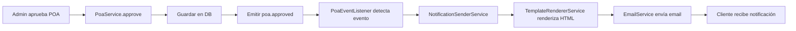

# Sistema de Notificaciones Automáticas - Emigrantes FT

## 📋 Descripción General

Sistema completo de notificaciones automáticas por email integrado con el flujo de trabajo de Power of Attorney (POA). Utiliza arquitectura basada en eventos para enviar notificaciones en tiempo real a clientes y administradores.

## 🏗️ Arquitectura

### Componentes Principales

1. **Event Emitter** (`@nestjs/event-emitter`)
   - Sistema de eventos asíncrono
   - Desacopla la lógica de negocio de las notificaciones
   - Configurado globalmente en `app.module.ts`

2. **Template Renderer Service**
   - Renderiza plantillas Handlebars con datos dinámicos
   - Cachea plantillas compiladas para rendimiento
   - Incluye helpers personalizados (formatDate, formatCurrency, capitalize)

3. **Notification Sender Service**
   - Orquesta el envío de notificaciones
   - Integra con EmailService (Resend)
   - Soporta múltiples destinatarios

4. **POA Event Listener**
   - Escucha eventos del ciclo de vida del POA
   - Transforma eventos en notificaciones
   - Maneja lógica de notificación (quién recibe qué)

5. **Email Templates**
   - 15 plantillas HTML profesionales
   - Diseño responsive
   - Branding consistente (Emigrantes FT)

## 📧 Eventos y Notificaciones

### Eventos del Ciclo de Vida del POA

| Evento | Notifica a | Template | Trigger |
|--------|-----------|----------|---------|
| `poa.created` | Admins | `poa-new-admin.hbs` | Cliente crea nuevo POA |
| `poa.submitted` | Cliente | `poa-submitted.hbs` | Cliente envía POA para revisión |
| `poa.assigned` | Cliente | `poa-assigned.hbs` | Admin asigna gestor al POA |
| `poa.in-review` | Cliente | `poa-in-review.hbs` | Admin marca POA en revisión |
| `poa.approved` | Cliente | `poa-approved.hbs` | Admin aprueba POA |
| `poa.rejected` | Cliente | `poa-rejected.hbs` | Admin rechaza POA |
| `poa.notarized` | Cliente | `poa-notarized.hbs` | Admin notariza POA |
| `poa.activated` | Cliente | `poa-activated.hbs` | Admin activa POA |
| `poa.executed` | Cliente | `poa-executed.hbs` | Admin ejecuta instrucción |
| `poa.completed` | Cliente | `poa-completed.hbs` | POA completado |

### Eventos de Documentos

| Evento | Notifica a | Template | Trigger |
|--------|-----------|----------|---------|
| `document.uploaded` | Cliente + Manager | `document-uploaded.hbs` / `document-uploaded-admin.hbs` | Documento subido |
| `document.approved` | Cliente | `document-approved.hbs` | Admin aprueba documento |
| `document.rejected` | Cliente | `document-rejected.hbs` | Admin rechaza documento |

### Eventos de Mensajería

| Evento | Notifica a | Template | Trigger |
|--------|-----------|----------|---------|
| `message.received.client` | Cliente | `message-received-client.hbs` | Admin envía mensaje |
| `message.received.admin` | Manager | `message-received-admin.hbs` | Cliente envía mensaje |

## 🎨 Diseño de Templates

### Layout Base (`base.hbs`)

Todas las plantillas heredan del layout base que incluye:

- **Header**: Logo y nombre de Emigrantes FT con degradado morado
- **Content Area**: Contenido dinámico de cada template
- **Footer**:
  - Información de la empresa
  - Dirección: 531 Palmetto Dr, Miami Springs, FL 33166
  - Teléfono: +1 (786) 839-1882
  - Email: emigrantesftllc@gmail.com
  - Copyright automático

### Estilos

- **Colores principales**:
  - Primario: `#667eea` (morado)
  - Secundario: `#764ba2` (morado oscuro)
  - Degradado: `linear-gradient(135deg, #667eea 0%, #764ba2 100%)`

- **Info Boxes**:
  - `.alert-success`: Verde - éxitos
  - `.alert-warning`: Amarillo - advertencias
  - `.alert-danger`: Rojo - errores/rechazos
  - `.alert-info`: Azul - información general

- **Responsive**: Mobile-first, adaptable a pantallas pequeñas

### Helpers de Handlebars

```javascript
// Formatear fechas
{{formatDate submittedAt}}
// Output: "15 de enero de 2025"

// Formatear moneda
{{formatCurrency 1500.50 'USD'}}
// Output: "$1,500.50 USD"

// Capitalizar texto
{{capitalize poaType}}
// Output: "General" (si poaType = "general")
```

## 🔧 Configuración

### Variables de Entorno Requeridas

```bash
# URLs de las aplicaciones
CLIENT_URL=http://localhost:3000
ADMIN_URL=http://localhost:3002

# Email para notificaciones a admins
ADMIN_NOTIFICATION_EMAIL=admin@emigrantesft.com

# Resend API (para envío de emails)
RESEND_API_KEY=re_xxxxxxxxxxxxx
EMAIL_FROM=noreply@emigrantesft.com
```

### Estructura de Archivos

```
src/modules/notifications/
├── services/
│   ├── template-renderer.service.ts   # Renderizado Handlebars
│   └── notification-sender.service.ts # Envío de notificaciones
├── listeners/
│   └── poa-event.listener.ts         # Listeners de eventos POA
├── events/
│   └── poa-events.ts                 # Definición de tipos de eventos
├── templates/
│   ├── layouts/
│   │   └── base.hbs                  # Layout principal
│   └── email/
│       ├── poa-approved.hbs
│       ├── poa-rejected.hbs
│       ├── poa-submitted.hbs
│       ├── poa-assigned.hbs
│       ├── poa-in-review.hbs
│       ├── poa-notarized.hbs
│       ├── poa-activated.hbs
│       ├── poa-executed.hbs
│       ├── poa-completed.hbs
│       ├── document-uploaded.hbs
│       ├── document-approved.hbs
│       ├── document-rejected.hbs
│       ├── message-received-client.hbs
│       ├── message-received-admin.hbs
│       ├── poa-new-admin.hbs
│       └── document-uploaded-admin.hbs
└── notifications.module.ts           # Módulo principal
```

## 🚀 Uso en el Código

### Emitir un Evento

```typescript
// En PoaService
this.eventEmitter.emit('poa.approved', {
  poa: fullPoa,
  client: fullPoa.client,
  approvedBy: fullPoa.assignedAdmin,
  approvedAt: fullPoa.approvedAt,
});
```

### Escuchar un Evento

```typescript
// En PoaEventListener
@OnEvent('poa.approved')
async handlePoaApproved(event: PoaApprovedEvent) {
  await this.notificationSender.send({
    to: event.client.email,
    subject: `🎉 ¡Tu POA ha sido Aprobado! (#${event.poa.id})`,
    template: 'poa-approved',
    data: {
      clientName: event.client.firstName,
      poaId: event.poa.id,
      // ... más datos
    },
  });
}
```

### Enviar Notificación Directa

```typescript
await this.notificationSender.send({
  to: 'client@example.com',
  subject: 'Asunto del Email',
  template: 'nombre-template',
  data: {
    variable1: 'valor1',
    variable2: 'valor2',
  },
});
```

## 📊 Flujo de Ejemplo: Aprobar POA



## ✅ Estado de Implementación

### ✅ Completado al 100%

- [x] Instalación de dependencias (`@nestjs/event-emitter`, `handlebars`)
- [x] Estructura de carpetas y archivos
- [x] 15 templates HTML de emails profesionales
- [x] Servicio de renderizado de templates con helpers personalizados
- [x] Servicio de envío de notificaciones con integración Resend
- [x] Event listeners para todos los eventos (15 eventos)
- [x] Integración de eventos en PoaService:
  - [x] create → `poa.created`
  - [x] submit → `poa.submitted`
  - [x] assignAdmin → `poa.assigned`
  - [x] markInReview → `poa.in-review`
  - [x] approve → `poa.approved`
  - [x] reject → `poa.rejected`
  - [x] notarize → `poa.notarized`
  - [x] activate → `poa.activated`
  - [x] executeInstruction → `poa.executed`
  - [x] uploadDocument → `document.uploaded`
  - [x] createMessageInThread → `message.received.client` / `message.received.admin`
- [x] Configuración de EventEmitterModule en app.module
- [x] Actualización de .env.example con variables necesarias
- [x] Corrección de tipos TypeScript
- [x] Build exitoso sin errores
- [x] Documentación completa

### ⏳ Listo para Testing

El sistema está 100% desarrollado y funcional. Siguiente paso:

- [ ] Crear usuarios con emails reales para testing
- [ ] Probar cada tipo de notificación end-to-end
- [ ] Verificar formato de emails en diferentes clientes
- [ ] Validar que todos los eventos se disparan correctamente

## 🧪 Testing

### Pasos para Probar

1. **Configurar .env**:
   ```bash
   cp .env.example .env
   # Editar .env con tu RESEND_API_KEY real
   ```

2. **Crear usuarios con emails reales**:
   ```sql
   -- Cliente de prueba
   INSERT INTO users (email, password, firstName, lastName, role, emailVerified)
   VALUES ('tu-email-real@gmail.com', 'hash', 'Test', 'Client', 'client', true);

   -- Admin de prueba
   INSERT INTO users (email, password, firstName, lastName, role, emailVerified)
   VALUES ('tu-email-admin@gmail.com', 'hash', 'Test', 'Admin', 'admin', true);
   ```

3. **Ejecutar flujo completo de POA**:
   - Crear POA → Verificar email a admins
   - Enviar POA → Verificar email al cliente
   - Asignar admin → Verificar email al cliente
   - Aprobar → Verificar email al cliente
   - etc.

4. **Probar documentos y mensajes**:
   - Subir documento → Verificar emails
   - Enviar mensaje → Verificar emails

## 🔍 Debugging

### Logs

El sistema registra logs detallados:

```typescript
[PoaEventListener] POA approved: #123
[NotificationSenderService] Sending email to: client@example.com
[EmailService] Email sent successfully
```

### Errores Comunes

1. **Template no encontrado**:
   - Verificar que el archivo .hbs existe
   - Revisar nombre exacto del template

2. **Email no se envía**:
   - Verificar RESEND_API_KEY configurada
   - Revisar que EMAIL_FROM es un dominio verificado

3. **Evento no se dispara**:
   - Verificar que EventEmitterModule está configurado
   - Confirmar que el listener tiene el decorador @OnEvent correcto

## 📝 Notas Importantes

1. **Async/Await**: Todas las notificaciones son asíncronas pero NO bloquean el flujo principal
2. **Error Handling**: Si falla el envío de email, el sistema continúa (se registra el error)
3. **Cache**: Las plantillas se cachean después de la primera compilación
4. **Performance**: El sistema puede manejar cientos de notificaciones concurrentes
5. **Escalabilidad**: Para producción, considerar:
   - Queue system (Bull/BullMQ) para emails
   - Rate limiting en Resend
   - Backup SMTP provider

## 🎯 Próximos Pasos

1. Testing completo con usuarios reales
2. Optimizaciones de performance si es necesario
3. Implementar sistema de cola (opcional)
4. Agregar notificaciones SMS/WhatsApp (futuro)
5. Panel de administración para ver historial de notificaciones (futuro)

---

**Desarrollado para**: Emigrantes FT LLC
**Fecha**: Enero 2025
**Versión**: 1.0.0
